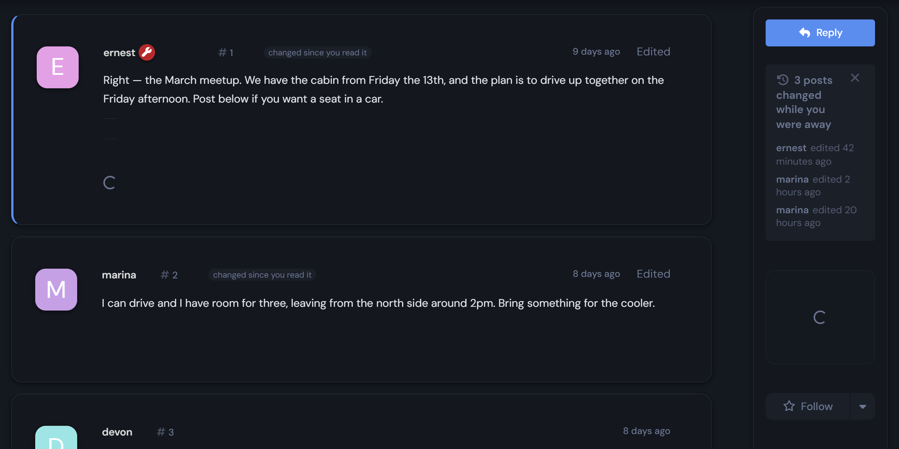
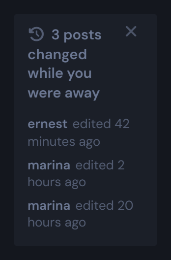
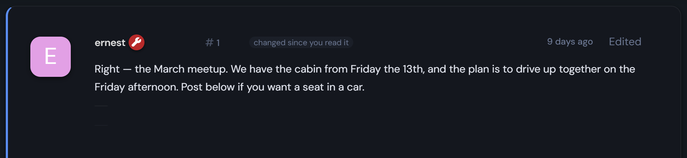

# Since

**Flarum 2** tells a returning reader what is *new*. It says nothing about what
**moved** — a post they read last week that has since been rewritten looks
exactly like one they have already read. Since is the missing half.


## What it looks like



Two things, both quiet:

- **A strip in the discussion sidebar** — who changed what, and when. Click a
  line to jump to that post.
- **A mark on each post** that changed after this reader had already read it.





The post below them in that shot was posted by someone else and never edited, so
it carries no mark. Neither does a post edited *before* the reader's last visit
— they saw the edit; it is not news.

## Why this needs saying

An edit is the one change Flarum's unread machinery cannot show you. New posts
move the unread marker. Edits do not move anything: the post keeps its place in
the thread, its timestamp stays where it was, and core's "Edited" label says only
*that* it was edited — not that it happened behind your back, while you were
away, after you had read and acted on the old wording.

In a thread that plans something — a date, a price, a rule, a decision — that is
the difference between reading the thread and knowing what it says.

## How it works

Entirely in the browser, from data the page already has.

| Piece | What it does |
|---|---|
| `baseline.js` | snapshots `lastReadAt` and `lastReadPostNumber` the first time anything asks |
| `editedSinceRead()` | a post counts if it is at or before the read mark **and** was edited after the read time |
| `ChangedStrip` | the sidebar strip, dismissable, collapsed past three |

No tables, no settings, no backend: the extension ships PHP only to register its
assets and locale.

**The snapshot is the whole trick.** Flarum `PATCH`es your read state as you
scroll, which overwrites the very attributes this compares against — so reading
the discussion destroys the record of what you had already read. Since captures
the arriving values once per page load and then leaves them alone. A refresh
legitimately loses the strip: you have now read those posts, and they are not
news a second time.

**Both halves of the test matter.** `editedAt` on its own would flag every
edited post in the thread, including ones edited long before the reader ever
arrived. The post number is what narrows it to what they actually saw.

## What it does not do

- **Posts in the loaded stream only.** No extra requests: if a changed post is
  a hundred replies further down and not loaded yet, it is not in the strip.
- **Signed-in members who have read the discussion before.** For everyone else
  the whole thread is new, which core's own unread divider already says better.
- **What changed is not shown.** This says a post moved and takes you to it; it
  is not a diff viewer.

## Installation

```bash
composer require ernestdefoe/since
```

Nothing to configure — enable it and it works.

## Licence

MIT
